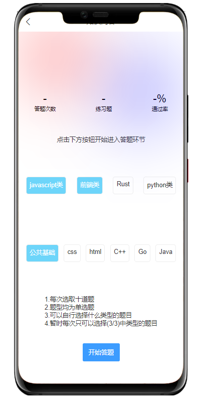
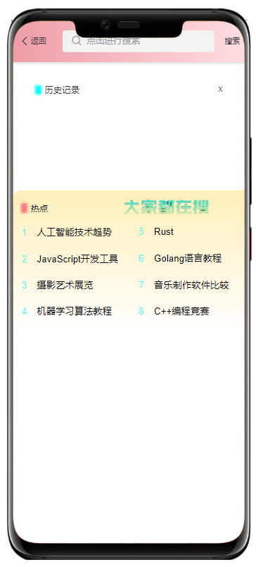

# Certishare

## 项目简介
Certishare是一个综合性在线学习平台，致力于为用户提供技术知识学习、问答练习及社区交流的全方位服务。平台采用现代化前端框架和稳定可靠的后端技术，打造流畅、高效的学习体验。

## 功能特点
- **知识浏览**：浏览多样化的技术内容和学习资料
- **题目练习**：提供JavaScript、Python、前端等多种类别的练习题
- **个人追踪**：记录答题历史、计算正确率、展示学习进度
- **社区互动**：支持发帖、评论、点赞等社区功能
- **多端适配**：支持微信小程序、H5等多种平台

## 项目预览
### 首页


### 答题功能



### 社区功能


### 搜索功能


### 个人中心


## 技术栈
### 前端
- Vue3
- uni-app
- TailwindCSS
- Pinia

### 后端
- Node.js
- Express
- MongoDB
- Mongoose
- JWT认证

## 项目结构
```
Certishare/
├── front-end-master/      # 前端项目
│   ├── pages/             # 页面组件
│   ├── components/        # 通用组件
│   ├── api/               # API接口
│   ├── stores/            # 状态管理
│   └── static/            # 静态资源
│
└── reconfiguration-master/ # 后端项目
    ├── models/            # 数据模型
    ├── router/            # 路由控制
    ├── utils/             # 工具函数
    └── db/                # 数据库配置
```

## 安装与使用
### 前端
```bash
cd front-end-master
npm install
npm run dev
```

### 后端
```bash
cd reconfiguration-master
npm install
node app.js
```

## 贡献指南
欢迎提交问题和功能请求。如需重大更改，请先打开issue讨论您想要更改的内容。

## 许可证
[ISC](LICENSE) 