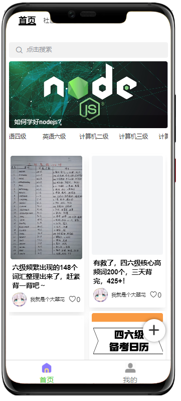
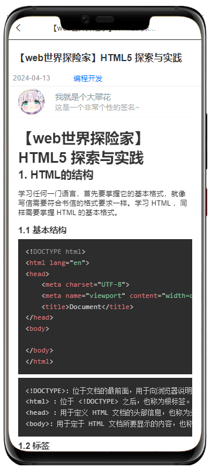

# Certishare

## Project Overview
Certishare is a comprehensive online learning platform dedicated to providing users with technical knowledge learning, quiz practice, and community interaction services. The platform utilizes modern frontend frameworks and reliable backend technologies to create a smooth and efficient learning experience.

## Key Features
- **Knowledge Browsing**: Browse diverse technical content and learning materials
- **Practice Exercises**: Access exercises in various categories including JavaScript, Python, Frontend, and more
- **Personal Tracking**: Record answer history, calculate accuracy rates, and display learning progress
- **Community Interaction**: Support for posting, commenting, liking, and other social features
- **Multi-platform Support**: Compatible with WeChat Mini Program, H5, and other platforms

## Preview
### Homepage


### Quiz Features


### Community Features



### Search Function


### Personal Center


## Technology Stack
### Frontend
- Vue3
- uni-app
- TailwindCSS
- Pinia

### Backend
- Node.js
- Express
- MongoDB
- Mongoose
- JWT Authentication

## Project Structure
```
Certishare/
├── front-end-master/      # Frontend project
│   ├── pages/             # Page components
│   ├── components/        # Common components
│   ├── api/               # API interfaces
│   ├── stores/            # State management
│   └── static/            # Static resources
│
└── reconfiguration-master/ # Backend project
    ├── models/            # Data models
    ├── router/            # Routing
    ├── utils/             # Utility functions
    └── db/                # Database configuration
```

## Installation and Usage
### Frontend
```bash
cd front-end-master
npm install
npm run dev
```

### Backend
```bash
cd reconfiguration-master
npm install
node app.js
```

## Contribution Guidelines
Contributions are welcome! Please feel free to submit issues and feature requests. For major changes, please open an issue first to discuss what you would like to change.

## License
[ISC](LICENSE) 