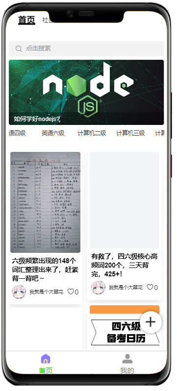
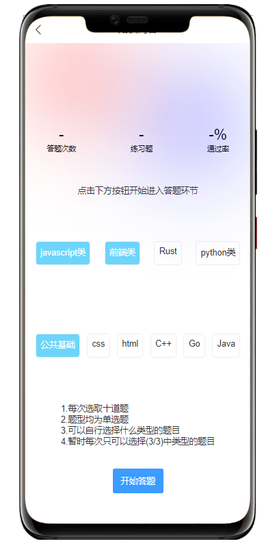
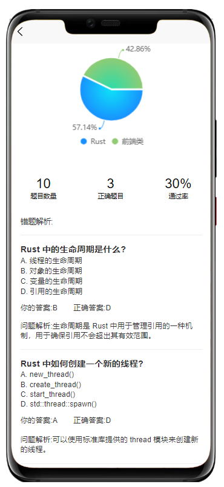
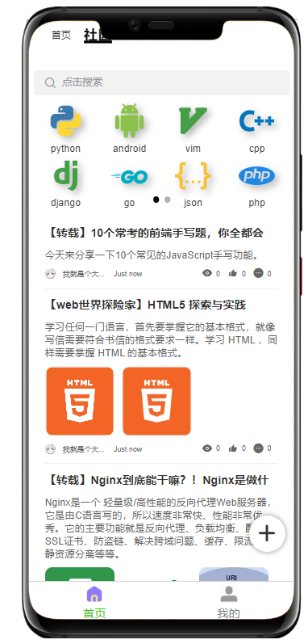
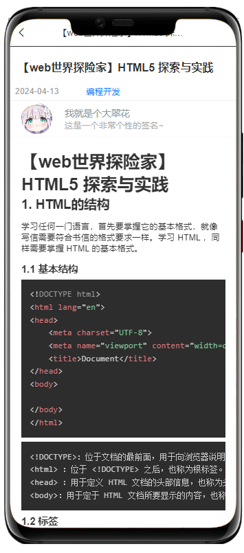
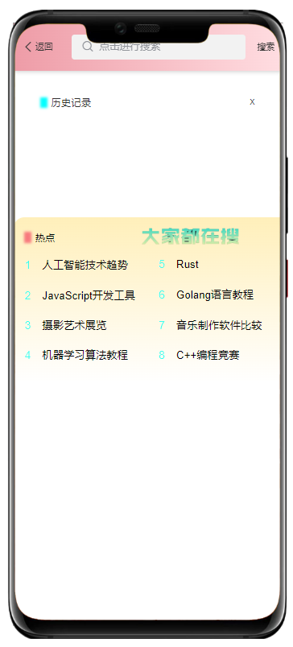
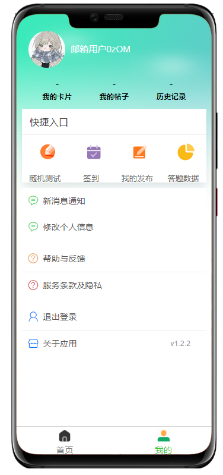

# Certishare

## プロジェクト概要
Certishareは、ユーザーに技術知識の学習、問題演習、コミュニティ交流の総合的なサービスを提供する統合型オンライン学習プラットフォームです。現代的なフロントエンドフレームワークと安定した信頼性のあるバックエンド技術を採用し、スムーズで効率的な学習体験を実現しています。

## 主な機能
- **知識閲覧**：多様な技術コンテンツと学習資料の閲覧
- **問題演習**：JavaScript、Python、フロントエンドなど様々なカテゴリの練習問題
- **個人記録**：解答履歴の記録、正答率の計算、学習進捗の表示
- **コミュニティ機能**：投稿、コメント、いいねなどの社会的交流機能
- **マルチプラットフォーム**：WeChatミニプログラム、H5など複数のプラットフォームに対応

## プレビュー
### ホームページ


### 問題演習機能




### コミュニティ機能



### 検索機能


### マイページ


## 技術スタック
### フロントエンド
- Vue3
- uni-app
- TailwindCSS
- Pinia

### バックエンド
- Node.js
- Express
- MongoDB
- Mongoose
- JWT認証

## プロジェクト構造
```
Certishare/
├── front-end-master/      # フロントエンドプロジェクト
│   ├── pages/             # ページコンポーネント
│   ├── components/        # 共通コンポーネント
│   ├── api/               # APIインターフェース
│   ├── stores/            # 状態管理
│   └── static/            # 静的リソース
│
└── reconfiguration-master/ # バックエンドプロジェクト
    ├── models/            # データモデル
    ├── router/            # ルーティング
    ├── utils/             # ユーティリティ関数
    └── db/                # データベース設定
```

## インストールと使用方法
### フロントエンド
```bash
cd front-end-master
npm install
npm run dev
```

### バックエンド
```bash
cd reconfiguration-master
npm install
node app.js
```

## 貢献ガイドライン
問題や機能リクエストの提出を歓迎します。大きな変更を加える場合は、まず変更したい内容についてissueを開いて議論してください。

## ライセンス
[ISC](LICENSE) 